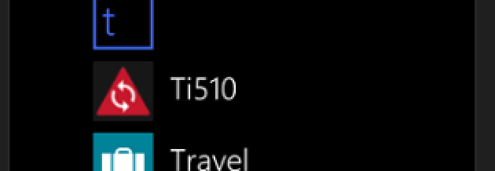
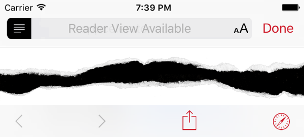
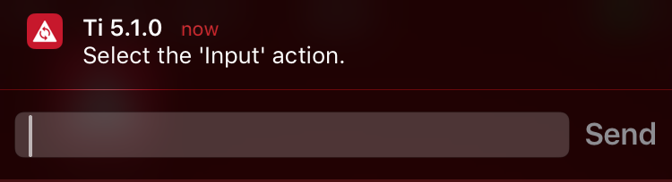
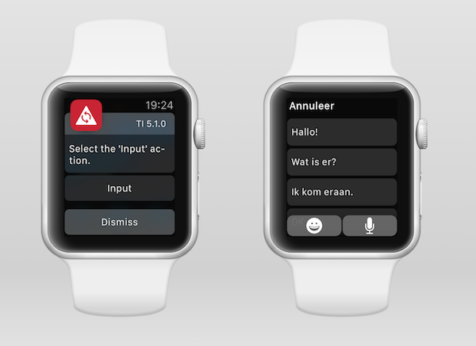
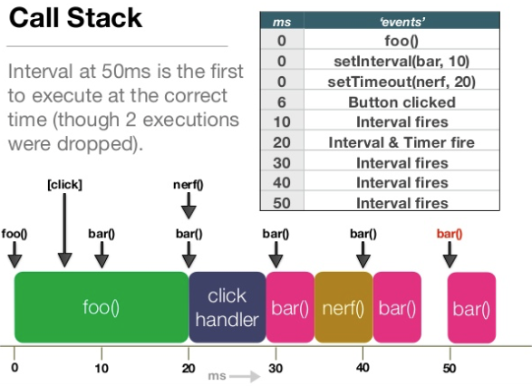
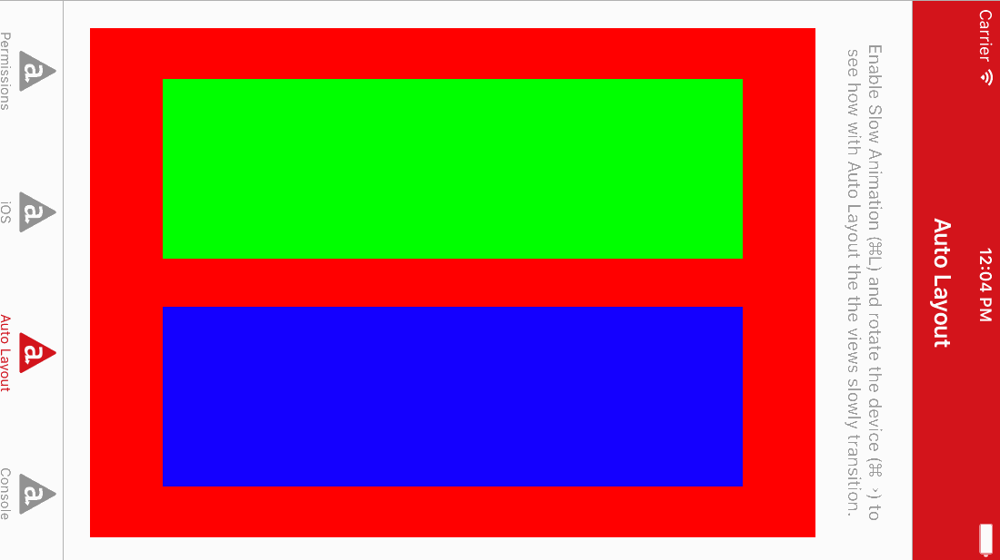
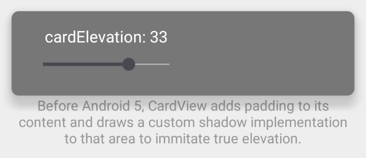
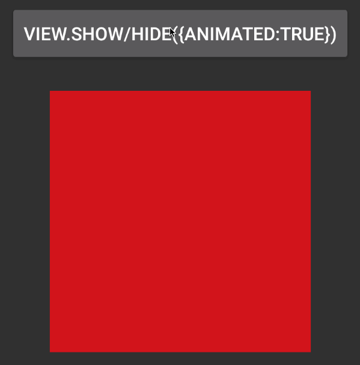

# Titanium 5.1.0 Sample App

> **NOTE:** This Sample App requires Titanium 5.1.0, Alloy 1.7.26 and AppC CLI Core Package 5.1.0 or later.

The [Titanium 5.1.0 Sample App](https://github.com/appcelerator-developer-relations/appc-sample-ti510) demonstrates most of the new features in Titanium 5.1.0, including a re-architected runtime permissions model, new Material Design elements, SafariDialog and also some major changes for iOS under the hood.

One of the most exciting new features is support for iPhone 6S 3D Touch with Peek & Pop and Home Screen Quick Actions. Exciting enough to deserve a dedicated [3D Touch Sample App](https://github.com/appcelerator-developer-relations/appc-sample-3dtouch).

For a full list of changes see the [Release Notes](http://docs.appcelerator.com/platform/release-notes/?version=5.1.0.GA).

## Device Permissions
This Release re-architected the way an application requests device permissions in order to support the new Android 6.0 model for requesting device permissions during runtime and to achieve parity between the Android and iOS platforms. Support for the Windows platform will be added in a later release.

### Sample
The *Permissions* tab has four buttons to test the new `has*Permissions()` and `request*Permissions` methods for `Ti.Calendar`, `Ti.Contacts`, `Ti.Geolocation` and `Ti.Media`. See [permissions.js](app/controllers/permissions.js) for how we're using both these new methods as well as some existing to check and request permissions. Tap the top right *Edit* button to open the settings screen to change your initial response to the permission request.

### Android
Android requires [uses-permission](http://docs.appcelerator.com/platform/latest/#!/guide/tiapp.xml_and_timodule.xml_Reference-section-29004921_tiapp.xmlandtimodule.xmlReference-uses-permission) elements to be added to `AndroidManifest.xml` for any permission you may request at runtime. Titanium will do this automatically if it finds a call like `Ti.Media.showCamera()` in your code, but if all you use are the new has- and request permissions methods [it will not](https://jira.appcelerator.org/browse/TIMOB-19933). A more likely scenario where you run into this is when you don't use the permissions in your JavaScript code but in a module. In this case you will have to manually [declare the permissions in tiapp.xml](http://docs.appcelerator.com/platform/latest/#!/guide/tiapp.xml_and_timodule.xml_Reference-section-29004921_tiapp.xmlandtimodule.xmlReference-uses-permission).

### iOS
On Android you can simply delete and reinstall the app for a blank slate. iOS remembers your permissions even after the app is removed. Change the app ID in `tiapp.xml` or reset the permissions for **all** your apps via *Settings > General > Reset > Reset Location and Privacy.* if you would like to test from a blank slate.

## Platform-specific DefaultIcon
In [Titanium 5.0](https://github.com/appcelerator-developer-relations/appc-sample-ti500) we introduced `DefaultIcon.png` to automatically generate all iOS app icons from a single source. In 5.1 we add support for Windows. With that we also introduce platform-specific DefaultIcons. iOS requires icons to be 24-bit with no alpha-channel. The other platforms do support or even promote the use of 32-bit PNGs with alpha-channel. To accomodate this the sample app has a 24-bit [DefaultIcon-ios.png](DefaultIcon-ios.png) and a 32-bit [DefaultIcon.png](DefaultIcon.png) which will be used if you build the app for Windows:

> **NOTE:** Other then showing off the DefaultIcon this sample app doesn't do much on Windows. We will have another sample soon to show how you can now mix and match Titanium Views and views created via [Runtime Direct API Access](http://docs.appcelerator.com/platform/latest/#!/guide/Windows_Runtime_Direct_API_Access).

## iOS
This release includes several new features for iOS.

### Safari Dialog
With iOS 9 [Apple introduced](https://developer.apple.com/videos/play/wwdc2015-504/) the [SFSafariViewController](https://developer.apple.com/library/prerelease/ios/documentation/SafariServices/Reference/SFSafariViewController_Ref/index.html). A great middle-road between having users leave your app by opening an URL in Safari or recreating a browser experience within your app using [Ti.UI.WebView](http://docs.appcelerator.com/platform/latest/#!/api/Titanium.UI.WebView). Think of it as a modal window, webview plus Safari features like Reader, AutoFill etc.

#### Sample
The first two buttons on the *iOS* tab open the same URL in both Safari - using [Ti.Platform.openURL](http://docs.appcelerator.com/platform/latest/#!/api/Titanium.Platform-method-openURL) - and the new Safari Dialog. Spot the differences!

#### Usage
Safari Dialog is not part of the Titanium SDK, but it is bundled as a separate module. This means we have to add it via [tiapp.xml](tiapp.xml#L81) and require it in [ios.js](app/controllers/ios.js). As you can see it has an `open` and `close` event and methods to check if the iOS version supports it and if the dialog is currently open. You can also programmatically close the dialog, which we do after 5 seconds. You can set the tintColor of the buttons in the dialog to fit your app and tell it to automatically open Reader if available.

### Picker
You can now change the height of a [Ti.UI.Picker](http://docs.appcelerator.com/platform/latest/#!/api/Titanium.UI.Picker-property-height) on creation. In our sample we have [set a date-picker to a height of 50](app/views/ios.xml) so that it only shows one row at a time.

### AlertDialog
Starting in this release, when using the alert dialog style `PLAIN_TEXT_INPUT` or `SECURE_TEXT_INPUT`, you can set the [placeholder](http://docs.appcelerator.com/platform/latest/#!/api/Titanium.UI.AlertDialog-property-placeholder), [keyboardType](http://docs.appcelerator.com/platform/latest/#!/api/Titanium.UI.AlertDialog-property-keyboardType) and [returnKeyType](http://docs.appcelerator.com/platform/latest/#!/api/Titanium.UI.AlertDialog-property-returnKeyType) properties you will probably already known from `Ti.UI.TextField` and `Ti.UI.TextArea`. For `LOGIN_AND_PASSWORD_INPUT` you'll have to use these properties prefixed with `login` and `password`.

The *iOS* tab of our sample demonstrates the use of these properties for all three styles. See the `alertDialog()` callback in [ios.js](app/controllers/ios.js) for the implementation.

### UserNotificationAction TEXTINPUT
Remember the [Interactive Notifications Sample](https://github.com/appcelerator-developer-relations/appc-sample-notifywatch)? With this release you can set an action's new [behavior](http://docs.appcelerator.com/platform/latest/#!/api/Titanium.App.iOS.UserNotificationAction-property-behavior) property to [TEXTINPUT](http://docs.appcelerator.com/platform/latest/#!/api/Titanium.App.iOS-property-USER_NOTIFICATION_BEHAVIOR_TEXTINPUT) to to have the user type and send a message directly from the notification:

I've updated the [Interactive Notifications Sample](https://github.com/appcelerator-developer-relations/appc-sample-notifywatch) so that you can reply with a custom chat message directly from the notification or even dictate it from your Apple Watch:

The *iOS* tab of our 5.1.0 sample allows you to test this small but significant new feature as well. Just hit the *TEXTINPUT* button and quickly lock your phone (`⌘L` in Simulator) or press the home button (`⇧⌘H`) to move the app to the background. The `localnotificationaction` event we listen to in [ios.js](app/controllers/ios.js) will have the input in its new `typedText` property.

## Under the hood
Also under the hood this release has a few major improvements for iOS. All three of them are optional for now.

### App Thinning
Since Titanium 5.0 we generate asset catalogs for iOS app icons and launch images. This was the first step to support [app thinning](https://developer.apple.com/library/tvos/documentation/IDEs/Conceptual/AppDistributionGuide/AppThinning/AppThinning.html), a process in which the App Store generates a unique app with only the resources appropriate for the device which is downloading your app.

With 5.1 we introduce the *option* to enable app thinning for regular image assets as well. We use a hash of the original image path as the asset catalog name so that you can use them in ImageViews and backgrounds as usual. But you will no longer be able to access images via `Ti.Filesystem`. Because of this breaking change it is optional for now and can be enabled via [tiapp.xml](tiapp.xml).

#### Sample
Build the app with and without app thinning (and clean in between builds: [TIMOB-19968](https://jira.appcelerator.org/browse/TIMOB-19968)) to see that the ImageView on the *iOS* tab will always work, but `Ti.Filesystem` in [ios.js](app/controllers/ios.js) won't be able to find the file when it's enabled.

### JS Main Thread
For several reasons, we used to run the JavaScript engine on a dedicated *KrollThread*. We now give you the option to run it on the Main Thread instead. This will allow us to get rid of many workarounds in our SDK and improve its performance and stability. However, it can also produce [unexpected behavior](https://jira.appcelerator.org/browse/TIMOB-19760). Some of this are issues we need to solve, but a lot of is also a matter of understanding threads and callstacks and optimizing your code to run on a single thread with the UI.

#### Making the most of your Single Thread
Titan [Ronald Treur](https://twitter.com/ronaldtreur) gave an excellent talk about [making the most of your Single Thread](http://www.slideshare.net/ronaldtreur/titanium-making-the-most-of-your-single-thread) at tiConf EU 2014. As you go through his slides, remember that calls to Titanium proxies will now be on the same callstack and will have to wait till the stacked codeblocks have been executed before they run.

#### Sample
The last test on the *iOS* tab will loop over an array to generate thousands of UUIDs. Test with and without main thread enabled in tiapp.xml to see how with unoptimized code found in the `testThread()` callback in [ios.js](app/controllers/ios.js) the progress bar won't update until all operations are finished if main thread is enabled. This is because the calls to update the progress bar are stacked until after all of `testThread()` is done. To the user it will look like the progress bar fills up at once after waiting for all operations to be finished.

In both of the two optimized versions each iteration on the array is pushed to the callstack separately. This means that the updates to the progress bar can be executed after each iteration. Still not inmediately as with main thread disabled, but with similar result. As Ronald explains this can be achieved with JavaScript's [setTimeout()](https://developer.mozilla.org/en-US/docs/Web/API/Window/setTimeout) with no (`0ms`) delay. Both Underscore's [defer()](http://underscorejs.org/#defer) bundeled with Alloy and the well-known [async package on NPM](https://www.npmjs.com/package/async) wrap this method. As you will see async's `eachSeries()` is faster (and also cleaner in code) then Underscore's `defer()`.

### Auto Layout
With this release you also have the option to use Apple's Auto Layout. This will allow us to support [Slide Over and Split View](https://developer.apple.com/library/prerelease/ios/documentation/WindowsViews/Conceptual/AdoptingMultitaskingOniPad/QuickStartForSlideOverAndSplitView.html) in a future release.

We hide the complex API for [Programmatically Creating Constrains](https://developer.apple.com/library/mac/documentation/UserExperience/Conceptual/AutolayoutPG/ProgrammaticallyCreatingConstraints.html) so you can continue to use `top`, `left` etc and leave the rest up to us. Since this is quite a dramatic revision of our layout system it is optional for now and can be enabled via [tiapp.xml](tiapp.xml). Please test it with your apps and [report any issues](https://jira.appcelerator.org/).

#### Sample
The *Auto Layout* tab demonstrates one of the benefits of this change. Run the app in the Simulator both with and without the option enabled in [tiapp.xml](tiapp.xml), activate *Debug > Slow Animations* (`⌘T`) and change the orientation of the device (`⌘→`) to see how with Auto Layout enabled the views slowly transition as the device rotates and also fixes a bug in the old layout system where the bottom percentage is not correctly calculated:

## Android: Material Design
This release introduces a few new Material Design components and updates buttons and preference panes to use the [AppCompat library](http://developer.android.com/tools/support-library/features.html#v7-appcompat) for them to look identical on older Android versions as well.

### CardView
Android [Cards](https://www.google.com/design/spec/components/cards.html) are meant to display heterogeneous (unique) content blocks and displayed with rounded corners and elevation. Create them with [Ti.UI.Android.createCardView](https://appcelerator.github.io/appc-docs/latest/#!/api/Titanium.UI.Android.CardView) or `<CardView>` since Alloy 1.7.20.

> **NOTE:** There are a few [known issues](https://jira.appcelerator.org/issues/?filter=17132) with CardView, most prominently of which is that at the moment contentPadding and cardCornerRadius ignore the default unit and use pixels. This will be addressed in the next patch release.

#### Sample
The *CardView* tab demonstrates all of the different properties that you can use. It also discusses how `cardUserCompatPadding`, `cardPreventCornerOverlap` and `cardMaxElevation` determine how the cards look on Android 4 and older using the AppCompat library. Read more about these important properties in the [Android Reference](http://developer.android.com/reference/android/support/v7/widget/CardView.html).

### Reveal effect
Another new Material Design element is the reveal effect for Android 5 and later. Go to the *Android* tab and tap the first button to see how the square uses the reveal effect to hide and show when you pass `animated:true` to the methods:

### ProgressBar Color
As the *Android* tab also demonstrates you can now set the color for the ProgressBar. Tap the bar to see it fill up in our primary brand color.

### AppCompat Button & Preferences Dialog
Thanks to the AppCompat library the buttons throughout the app no longer look different between Android versions like they used to:

The same is true for the [Preferences Dialog](http://developer.android.com/guide/topics/ui/settings.html#DefiningPrefs), which now has an Action Bar on older Android versions as well. If you're not familiar with the Preferences Dialog, check [our documentation](http://docs.appcelerator.com/platform/latest/#!/api/Titanium.UI.Android-method-openPreferences) and see how we define the dialog in [preferences.xml](platform/android/res/xml/preferences.xml).

#### Testing
To see the differences build the app with Titanium 5.1 for several Android versions to see the buttons always look the same. Then open [tiapp.xml](tiapp.xml), remove the comments around `<uses-sdk>` and change the `<sdk-version>` to 4.1.1 or older. Build again for different Android versions to see that the buttons are like the above screenshot.
